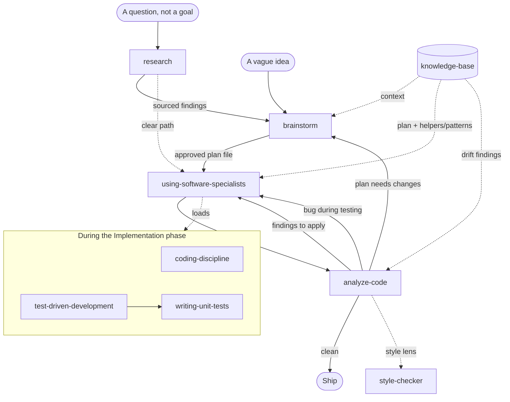

# coding-skills

A collection of Claude Code skills for software development — reusable
behavioral modules that load specialist mindsets, enforce discipline, and
structure complex workflows.

## What's a Skill?

A Claude Code skill is a Markdown file (or directory) with a `SKILL.md` at the
root. The file starts with a YAML header declaring a `name` and `description`.
Claude Code loads it on demand via the `/skill-name` slash command, injecting
focused instructions for a specific domain.

## Skills

| Skill | What it does |
|-------|-------------|
| [analyze-code](analyze-code/) | Multi-lens audit of existing code across architecture, quality, performance, security, and style. Produces a prioritized findings report — a deep review, not a gate decision. |
| [brainstorm](brainstorm/) | Turns vague ideas into concrete, validated specs through Socratic dialogue — one question at a time. No implementation until the design is approved. |
| [coding-discipline](coding-discipline/) | Names the six most common LLM coding failure modes (silent assumption, scope creep, speculative complexity, hallucination, drift, parallel solution) and the counter-move for each. |
| [knowledge-base](knowledge-base/) | User-curated, agent-maintained project wiki for system surfaces (entities, interfaces, jobs, dependencies, events, business rules) and implementation plans. Queryable on its own; consulted by `brainstorm`, `using-software-specialists`, and `analyze-code` when a `kb_path` is configured. |
| [research](research/) | Answers questions about *your own codebase* — endpoints, event payloads, "what happens when X?", "how do I run X?" — by reading the actual source (serena + the KB), never from memory. Brings a sourced, cited answer instead of interrogating you; effort scales from a one-line lookup to a full traced investigation. External / best-practice questions are handed off to the `deep-research-agent` specialist. The inverse of `brainstorm`. |
| [style-checker](style-checker/) | Reviews code against Google's official style guidelines. Produces a structured violation report grouped by severity (Critical / High / Medium / Low). Supports Go, Java, Python, JavaScript, TypeScript, Shell, and Markdown. |
| [test-driven-development](test-driven-development/) | Enforces the Red→Green→Refactor cycle before any production code is written. Covers the full TDD workflow: writing a failing test first, minimal implementation, and safe refactoring with a green suite. |
| [using-software-specialists](using-software-specialists/) | Routes software tasks to the right specialist mindset (security engineer, architect, tester, DBA, etc.) at the right phase. Includes a phase model, a task-routing table, and a "Validate Before Done" gate. |
| [writing-unit-tests](writing-unit-tests/) | Guides unit test authorship in any language — scenario identification across four quadrants, FIRST-U principles, Arrange–Act–Assert structure, mocking strategy, and language-specific references. |

## Installation

Copy the skill directories you want into your Claude Code skills folder:

```bash
cp -r analyze-code brainstorm coding-discipline knowledge-base research style-checker test-driven-development using-software-specialists writing-unit-tests ~/.claude/skills/
```

Skills are then available as slash commands in any Claude Code session:

```
/analyze-code
/brainstorm
/coding-discipline
/knowledge-base
/research
/style-checker
/test-driven-development
/using-software-specialists
/writing-unit-tests
```

## Usage

Invoke a skill by typing its slash command, optionally followed by a
description of your task:

```
/research do we have an endpoint for password reset, and what's its payload?
/brainstorm I want to build a rate limiter for our API
/style-checker review the auth module
/using-software-specialists add OAuth support to the backend
```

See each skill's own `README.md` for detailed usage, file structure, and
examples.

## Workflows

A typical feature-development loop using these skills:

0. **Research (whenever you have questions, not a goal)** — `/research`
   brings a sourced, cited answer about your *own codebase* ("do we have an
   endpoint for X?", "what's the payload of event X?", "what happens when X?")
   by reading the source with serena + the KB, never from memory. Effort
   scales — a one-line lookup stays ceremony-free; a deep trace gets confidence
   levels and named gaps. Its findings make brainstorm's intent questions
   answerable; for an already-clear path it can hand straight to
   `using-software-specialists`. (External / best-practice questions go to the
   `deep-research-agent` specialist, not here.)
1. **Define** — `/brainstorm` scopes the change through Socratic dialogue and
   produces an approved *spec*, then hands off to the Project Planner specialist,
   which turns the spec into an execution plan. The plan is saved into the KB
   under `<kb_path>/plans/` (or `docs/specs/` when no `kb_path` is configured),
   so it persists across sessions and — for cross-repo work — can be referenced
   from any repo.
2. **Build** — `/using-software-specialists` ingests the plan, validates it
   against the Plan-phase done-criteria, and implements. The Implementation
   phase loads `coding-discipline` and `test-driven-development` (which pulls
   in `writing-unit-tests`) before any code is written.
3. **Audit** — `/analyze-code` reviews the result and produces a
   severity-ranked findings report with a *Suggested Next Actions* block
   that routes each finding cluster back to the right specialist.

The loop then closes through one of three back-edges:

* **Findings to apply** → re-enter `/using-software-specialists` with the
  specialist named in the analyze-code report.
* **Plan needs changes** → re-enter `/brainstorm` against the existing plan
  file. It enters revision mode — diffs the requested change, asks only
  about the deltas, and updates the plan in place.
* **Bug surfaced during testing** → re-enter `/using-software-specialists`
  starting with Troubleshooter.

`/style-checker` is invoked on demand, or as the Style lens of every
`/analyze-code` run (independent of whatever linter the project ships, which
analyze-code runs separately as configured tooling).

`/knowledge-base` sits underneath the loop as a shared substrate when
`kb_path` is configured in CLAUDE.md: `brainstorm` reads the wiki for
system context, and the Project Planner it hands off to writes the resulting
plan into `plans/`; `using-software-specialists`
loads it during Implementation to read the matching plan and the repo's
`Helpers` / `Patterns`; `analyze-code` reads it during Frame and surfaces
wiki↔code disagreements as findings. The user invokes `/knowledge-base`
directly to query, ingest, update, or lint.



## License

MIT — see [LICENSE](LICENSE).
